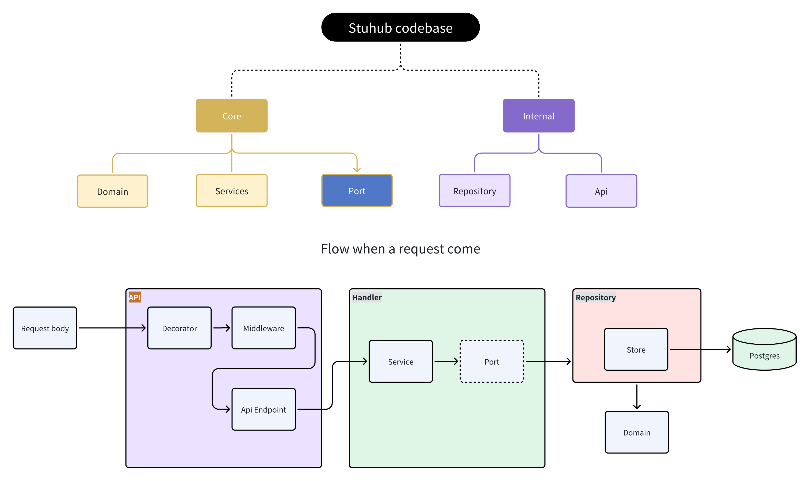

# Stuhub Core API
<!-- <p align="center">
  
  
  <a href="https://github.com/consolelabs/mochi-api/blob/main/LICENSE">
    
  </a>
  <a href="https://discord.gg/DMVyp5Fr8Q">
  
  
  
  <a href="https://twitter.com/getmochi_bot">
  
  </a>
</p> -->

## Overview

This repository is official BE service for **[Stuhub.io](https://stuhub-web-dev.vercel.app/)**

## How to contribute

### Prerequisites

1. Go installed
2. Docker installed

### How to run source code locally
If the command result in `make: *** build/...: Is a directory`, try run command with ENV=local|staging|production

1. Set up source

   Set up local dev infras (containers), install dependencies, etc.
   ```
   make setup
   ```

2. Set up env

   Update these variables inside `build/local/*/.env`

3. Run source

   ```
   make up
   ```

   You should see the service starting with port 5000 as default

4. Migrate

   ```bash
   make migrate-create # For create new migration files
   make migrate-up # Migrate Up
   make migrate-down # Migrate Up
   ```

<!-- ### How to work on a TODO

1. Feel free to pick any TODO for you from [Board View](https://www.notion.so/2b9be3fffef74705830ad77058e35c95) → Mochi → Backlog\*\*
2. **Assign** that item to your account
3. Remember to update item’s **status** based on your working progress
   - `Backlog`: not started yet
   - `In Progress`: still working on
   - `In Review`: Task done = PR has been merged to `develop` branch at least
   - `Completed`: Confirmation from the team that the TODO is completely finished
4. When switching your TODO to `In Review`, remember to fill these in
 -->

### PR template

```markdown
**What does this PR do?**

- [x] New API for updating ...
- [x] Update logic of ...
- [x] Fix error ...

**How to test**

- cURL
- Steps to test new logic
- etc.

**Flowchart** (optional)
Should have if the flow is complex

**Media** (Demo) (optional)
Attach images or demo videos
Can insert video URL in case the size exceeds github limit
```

## Technical Document

1. **Project structure**

- `build/`: this folder contains the configuration info for api, postgres and redis, including docker and env files
- `cmd/`: contains the file main.go to run the program
- `config/`: loading and managing configuration specifications from build folder
- `core`: handling and define business logic and domains, soul of the app
   - `domain/`: define business entities
   - `port/`: define interface to enforce services to follow so it can access repository package
   - `services/`: handling business logic 
- `docs/`: setup configuration for swagger api document
- `internal/`: contains external and third-party services like apis, cache, database and oauth,...
- `logger/`: setup debug logging
- `misc/`: contains migration files
- `utils/`: contains most reused functions
- `.air.toml`: used for live reloading in Go applications
- `.golangci.yaml`: specify linters to apply for source code
- `gen.yaml`: help to create Go structs that map to the specified database tables
- `go.mod`: contain and manage dependencies, specifies go version
- `go.sum`: contains checksum of dependencies listed in `go.mod`, ensure those not be tempered
- `local.yml`: to run docker compose
- `Makefile`: contain command lines for setup and running the application
<!-- 
.
- `cmd/` this folder contains the main application entry point files for the project
  - `server/main.go`: Containing init function `main()` of the service. This function will be executed when we run `make dev`
  - Other `main.go` files (e.g. `fetch-discord-users/main.go`): Entry points to execute some functional jobs. k8s Cronjob will be set up to execute these jobs schedually
- `docs/`: contains Swagger documentation files generated by [swaggo](https://github.com/swaggo/swag)
- `migrations/`: contains seeds and SQL migration files
  - `schemas/`: contains DB schema migration files
  - `seed/`: contains seed files which will initialize DB with sets of dummy data
  - `test-seed/`: also seed files but for test DB
- `pkg/`: contains core source code of service
  - `cache/`: caching initial and functional methods
  - `chain/`: crypto chains’ initial and functional methods
  - `config/`: contains configs loaded from `.env`
  - `constants/`: constant variables
  - `discordwallet/`: methods to initialize & interact with crypto’s wallets (managed by Mochi)
  - `handler/`: handling API requests
  - `entities/`: where mainly core business logic happens, invoked by `handler` and `cmd`
  - `job/`: contains initial and `Run()` as execution functions. These are invoked by `main()` from `main.go` files (except `server/main.go`)
  - `logger/`: logging initial and functional methods
  - `model/`: DB model structs
  - `repo/`: data access layer, contains DB CRUD operations (see [gorm](https://gorm.io/))
  - `request/` & `response/`: API request & response models
  - `routes/`: API routing (see [gin](https://github.com/gin-gonic/gin))
  - `services/`: contains interaction with external services (coingecko API, binance API, etc.)
  - `util/`: utility methods
 -->

3. **Sample usecases**
<!-- 
   1. Create new API
      - Check out file `/pkg/routes/v1.go` and explore the code flow to see how to create and handle an API
      - Remember to annotate handler functions with [swaggo](https://github.com/swaggo/swag). Then run `make gen-swagger` to generate Swagger documentations
   2. New DB migration

      Check out `.sql` files under `/migrations` to write a valid schema migration / seed file

      - To apply new migration files, run `make migrate-up`
      - To apply seed files, run `make seed-db`
      - To apply new migration files for test DB, run `make migrate-test`

      **Note:** remember to run these 2 every time you pulling new code

      ```
      make migrate-up
      make migrate-test
      ```

   3. DB repositories

      Check out dirs under `/pkg/repo`
      **Note:** remember to run `make gen-mock` to generate mocks for new `store` file -->
